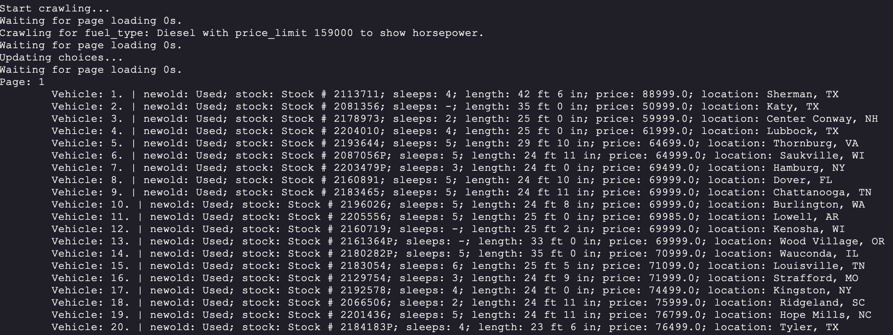

# Crawling for RVs

Created by Kunhong Yu

In this repo, [RVs website](https://rv.campingworld.com/rvclass/motorhome-rvs) is scraped using Selenium within a single Python script `task.py`.

## Prerequsite

In order to run code, one may have to install some external packages by running the following command.

```Python
pip install -r requirements.txt
```
## Idea

In this simple implementation, some of the details of vehicles are scraped. 

1. new or old
2. stock number
3. number of sleeps
4. length
5. price
6. location
7. horsepower(optional/another page)

We have to first choose fuel type by clicking corresponding radio button and refresh our page, this is done by function `crawl`, then, for each page, we have to scrape each vehicle's above information, we notice all information for one vehicle in one panel, we therefore loop through all panels in one page to get information using `xpath` in function `getVehiclesInfo`. In the meantime, we collect information in a list of dictionary to further analyse it. Notice we also need to collect horsepower if price is above some limit, unfortunately, horsepower is in another page by clicking a button in the main page, we use another instance of `webdriver` to open it and scrape it then close it in function `getHorsepower`. Last but not least, jumping to the next page is also implemented, if there is no next page, we throw an exception to let it end normally. Here, we add time to sleep function `waitToLoad` when scraping each item in order to let each page refresh and not let website block us. Scraped information is all stored in a pandas data frame. We also try BeautifulSoup, but website is blocking this tool.

## Usage

In our code there are only two parameters set, user can denote different values easily.

```python 
fuel_type # 'Diesel'/'Gas'/'Any'              
price_limit # To tell if showing horsepower since we can not get vehicles more expensive than 300000
```

To run code, one may simply type in the command:

```
python task.py --fuel_type 'Diesel' --price_limit 159000
```

Note that running may be too slow if you set a low `price_limit` since it is often the case web will jump to another page to collect horsepower.

Quick screenshot in our implementation:



## Analysis 

We did a very simple analysis in `analysis.ipynb` notebook, here, we quickly take a look at if information is complete and unique, then dig little deeper on some information. One may take a look in detail in this notebook.


<center>***Veni，vidi，vici --Caesar***</center>

